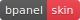
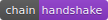

title: bMoon Skin
layout: tutorial

---

  
# Description
The bMoon skin for bPanel.

# Install
<pre>
<button class="btn" data-clipboard-target="#code-1"></button>
<code class="shell">$ <mark id="code-1">npm i @bpanel/bmoon</mark></code></pre>

# Images
