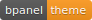

title: bMenace Theme
layout: tutorial

---

  
# Description
The first in a chain of reference themes for bPanel.

This is a simple plugin that bundles together a collection of existing bPanel plugins to create a useful interface to help you get started with the platform. bPanel will come pre-installed with this theme, but can be removed by editing bPanel's `config.js` or by using [bpanel-cli](https://github.com/bpanel-org/bpanel-cli)

Includes:
- [@bpanel/bmenace-theme](/tutorials/bmenace_skin.html)
- [@bpanel/bpanel-footer](/tutorials/footer.html)
- [@bpanel/bpanel-header](/tutorials/header.html)
- [@bpanel/dashboard](/tutorials/dashboard.html)

# Install
<pre>
<button class="btn" data-clipboard-target="#code-1"></button>
<code class="shell">$ <mark id="code-1">npm i @bpanel/bMenace-theme</mark></code></pre>

# Images

