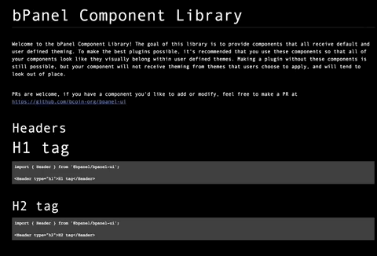

title: BUI
layout: tutorial
---

  
# Description
A simple bPanel plugin for displaying available bpanel-ui components.

# Install
<pre>
<button class="btn" data-clipboard-target="#code-1"></button>
<code class="shell">$ <mark id="code-1">npm i @bpanel/bui</mark></code></pre>

# Images
