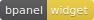
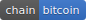
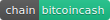
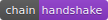
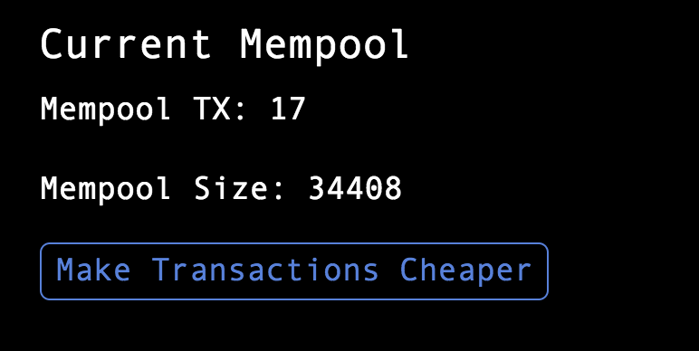

title: Mempool Widget
layout: tutorial
---

  
# Description
A simple widget for the [bPanel Dashboard plugin](/tutorials/dashboard.html). The mempool widget decorates the secondary widget area below the larger primary area. Order of widgets in secondary area will depend on the order in which the widget plugins were installed.

The widget relies on the [chain sockets](https://github.com/bpanel-org/chain-sockets) plugin to subscribe to new transaction events via websockets. TX count and mempool size will increase (and decrease) as new transactions are received and blocks found.

# Install
<pre>
<button class="btn" data-clipboard-target="#code-1"></button>
<code class="shell">$ <mark id="code-1">npm i @bpanel/mempool-widget</mark></code></pre>

# Images

(Note: you cannot actually make transactions cheaper by clicking a button. The button in the widget has no actual effect.)