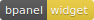
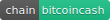

title: Recent Blocks
layout: tutorial

---

  
# Description
This is a widget for the bPanel dashboard that displays the top 10 most recent blocks synced with your node. Rows are expandable giving you more access to information about the block and includes an easy copy link.

Simply add `'@bpanel/recent-blocks'` to your pluginsConfig.js `plugins` array, and refresh your bPanel!

# Install
<pre>
<button class="btn" data-clipboard-target="#code-1"></button>
<code class="shell">$ <mark id="code-1">npm i @bpanel/recent-blocks</mark></code></pre>

# Images

