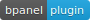

title: Simple Mining
layout: tutorial

---

  
# Description
This is a very basic, simple plugin for running some basic mining. We hope to make a more comprehensive mining focused dashboard view in the future. For now, this is mostly for testing simnet and regtest environments.

Simply add `'@bpanel/simple-mining'` to your pluginsConfig.js `plugins` array, and refresh your bPanel! Alternatively, install with NPM as shown.

# Install
<pre>
<button class="btn" data-clipboard-target="#code-1"></button>
<code class="shell">$ <mark id="code-1">npm i @bpanel/simple-mining</mark></code></pre>

# Images

