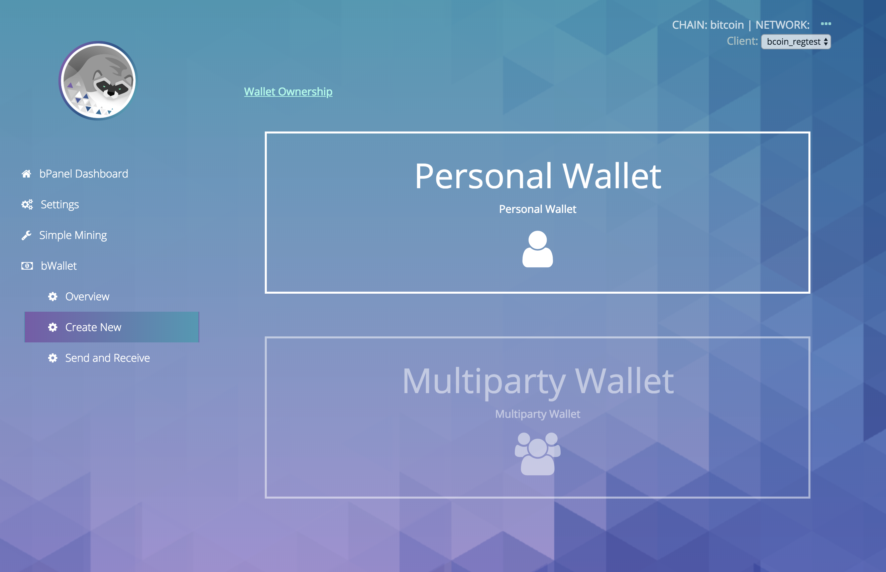

title: Simple Wallet
layout: tutorial

---

 
# Description
Send and Receive your Bitcoin using the `bPanel Simple Wallet`.
Use as a plugin with `bPanel` to access your `bcoin` Bitcoin node.

- Create `bcoin` wallets and accounts
- Send and recieve bitcoin transactions
- View transaction history

In `github.com/bpanel/bpanel`, update the file `webapp/config/pluginsConfig.js`
so that the plugins array contains `@bpanel/simple-wallet`.

This will include the plugin in your `bPanel` setup.

# Install
<pre>
<button class="btn" data-clipboard-target="#code-1"></button>
<code class="shell">$ <mark id="code-1">npm i @bpanel/simple-wallet</mark></code></pre>

# Images
